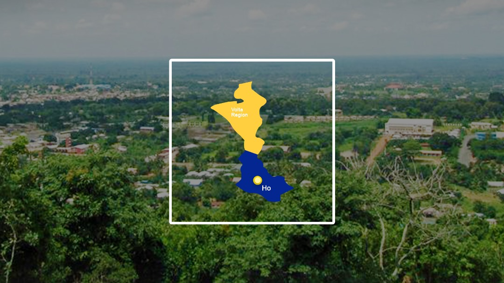

<!-- Full width banner image -->

  <!--  -->

<!-- Centered content -->

    

    

        

            

                <strong>Date:</strong> 
                October 25th - 26th, 2024, Ho, Volta.
            

            

            <strong>Venue:</strong> 
                University of Health and Allied Sciences,
                Ho, Volta.
            

        

        <h2 class="hero-text-sub highlight-text">
            The Regional Python community conference for all levels of enthusiasts, beginners, intermediates, and advanced professionals,
             
            based in Volta.
        </h2>
    

