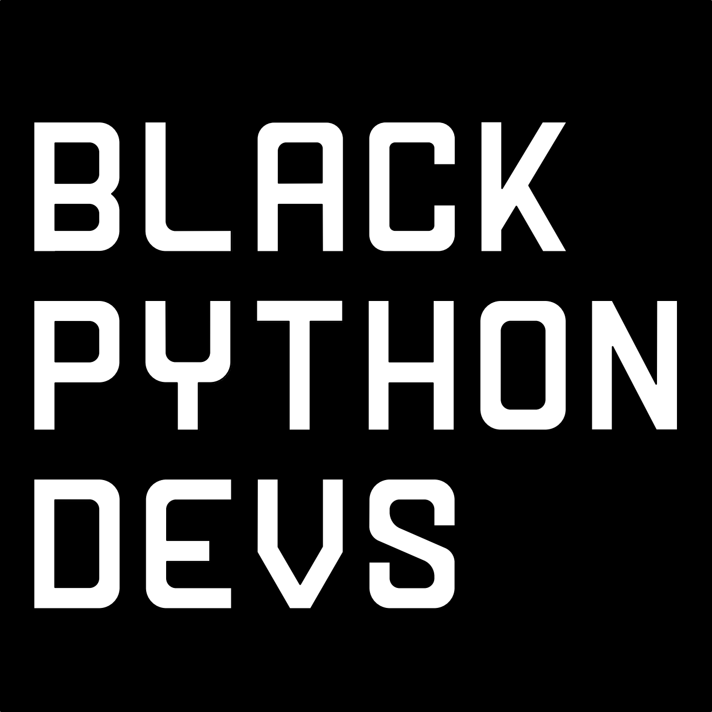
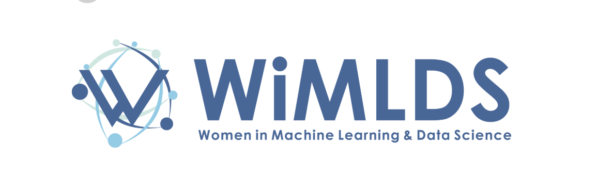
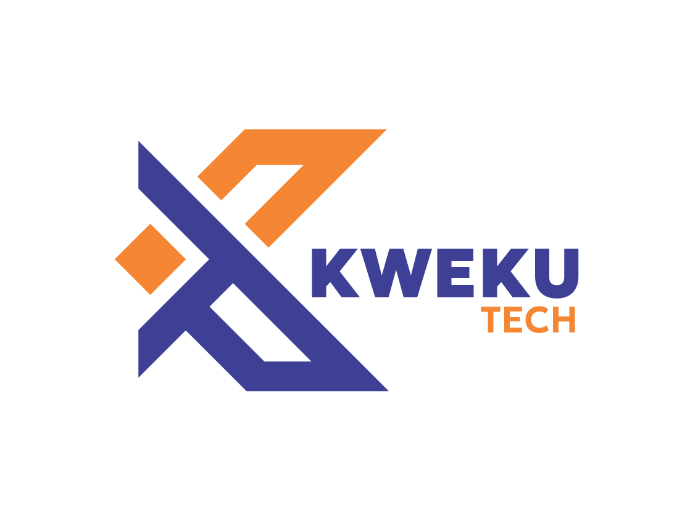

## Sponsors

Welcome to our sponsors page. We are grateful to our amazing partners for their support. Below is a list of our sponsors categorized by their contributions.

---

## Grant

The mission of the Python Software Foundation is to promote, protect, and advance the Python programming language, and to support and facilitate the growth of a diverse and international community of Python programmers. The majority of the PSF's work is focused on empowering and supporting people within the Python community. The PSF has active grant programs that support sprints, conferences, meet ups, user groups, and Python development efforts all over the world. In addition, the PSF underwrites and runs PyCon US, the primary Python community conference. Being part of the PSF means being part of the Python community. Recently we changed the PSF to an open membership organization, so that everyone who uses and supports Python can join. To learn more, visit https://www.python.org/psf/membership.

---

## Community

PyLadies is an international mentorship group with a focus on helping more women and non-binary people become active participants and leaders in the Python open-source community. Our mission is to promote, educate, and advance a diverse Python community through outreach, education, conferences, events, and social gatherings.

PyLadies aims to provide a friendly support network for women & non-binary people and a bridge to the larger Python world. Anyone with an interest in Python is encouraged to participate!

Black Python Devs intends to be a dedicated source of support for Black and Colo(u)red Pythonistas and the organizations supporting them around the globe.
BPD community focuses on creating a space for Black Pythonistas of all skill levels to connect, learn and share with one another.

Genius IT Brainery is on a mission to empower young Africans with industry-relevant ICT skills, nurture leadership and entrepreneurial potential, and position Africa as a hub for transformative IT leaders.

We are happy to have JetBrains support us through their User Group Support Program! Which aims to provide us with access to their development tools for productivity and efficiency.

ICP Ghana focuses on building a thriving Web3 and blockchain ecosystem through the Internet Computer Protocol (ICP) by actively engaging developers, students, and entrepreneurs across the country to transition from Web2 to Web3 - via hands-on workshops, hackathons, and mentorship programs.

---

## Diversity

Supporting diversity and inclusion initiatives to ensure everyone has equal opportunities to participate.

---

## Media

Our media partner, helping us spread the word through publications and digital media coverage.
